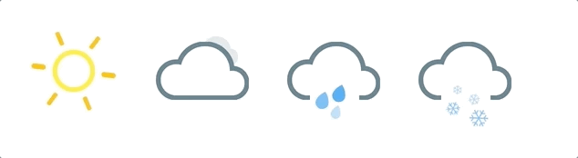

# weather-styled-icon

[![Greenkeeper badge][greenkeeper-image]](https://greenkeeper.io/)
[![NPM Version][npm-image]][npm-url]
[![Build Status][travis-image]][travis-url]
[![Coveralls][coverrals-image]][coverrals-url]
[![Storybook][storybook-image]][demo-link]
[](https://eslint.org/)

Animated and configurable weather icons made in React ⚛️, using styled-components 4 💅 and CSS3 Animations.

Check this [Storybook][demo-link] to try them!

Icons and styles were taken from this [Codepen](https://codepen.io/joshbader/pen/EjXgqr?q=weather&limit=all&type=type-pens), please leave him a start 🌟



## Installation

```sh
npm install weather-styled-icon
```

## Usage example

The library exports in total 4 icons, each one can be configurable by props:

- [Sunny](#sunny)
- [Cloudy](#cloudy)
- [Rain](#rain)
- [Snow](#snow)

### Sunny

```javascript
<Sunny size={1} />
```

### Cloudy

```javascript
<Cloudy
  size={1}
  patchy // Show the sun at a side of the cloud
/>
```

### Rain

```javascript
<Rain
  size={1}
  patchy // Show the sun at a side of the cloud
  lighting // Show rays instead of drops falling of the cloud
/>
```

### Snow

```javascript
<Snow
  size={1}
  patchy // Show the sun at a side of the cloud
/>
```

_For more examples and usage, please refer to the [Storybook][demo-link]._

## Theming

All the icons of the library are easy to style. Just by rendering `WeatherThemeProvider` before the use of the icons, they will pick the pallete from the theme.

```javascript
import {
  WeatherThemeProvider,
  Sunny,
  Rain,
  Snow,
  Cloudy,
} from 'weather-styled-icons';

const theme = {
  cloudsColor: 'MidnightBlue',
  dropsColor: 'white',
  boltColor: 'lightBlue',
  backgroundColor: 'Lavender',
  sunColor: 'Orange',
  raysColor: 'OrangeRed',
};

const App = () => (
  <WeatherThemeProvider theme={theme}>
    <Sunny />
    <Cloudy />
    <Rain />
    <Snowy />
  </WeatherThemeProvider>
);
```

[](https://codesandbox.io/s/xlklnkoq4q)

## Licence

MIT.

## Contributing

1. Fork it (<https://github.com/EmaSuriano/weather-styled-icon/fork>)
2. Create your feature branch (`git checkout -b feature/fooBar`)
3. Commit your changes (`git commit -am 'Add some fooBar'`)
4. Push to the branch (`git push origin feature/fooBar`)
5. Create a new Pull Request

<!-- Markdown link & img dfn's -->

[greenkeeper-image]: https://badges.greenkeeper.io/EmaSuriano/weather-styled-icon.svg
[npm-image]: https://badge.fury.io/js/weather-styled-icon.svg
[npm-url]: https://www.npmjs.com/package/weather-styled-icon
[travis-image]: https://travis-ci.org/EmaSuriano/weather-styled-icon.svg?branch=master
[travis-url]: https://travis-ci.org/EmaSuriano/weather-styled-icon
[wiki]: https://github.com/yourname/yourproject/wiki
[storybook-image]: https://img.shields.io/badge/%F0%9F%93%93-Storybook-ff69b4.svg
[demo-link]: https://emasuriano.github.io/weather-styled-icon/?selectedKind=%40Welcome
[coverrals-image]: https://coveralls.io/repos/github/EmaSuriano/weather-styled-icon/badge.svg?branch=master
[coverrals-url]: https://coveralls.io/github/EmaSuriano/weather-styled-icon
